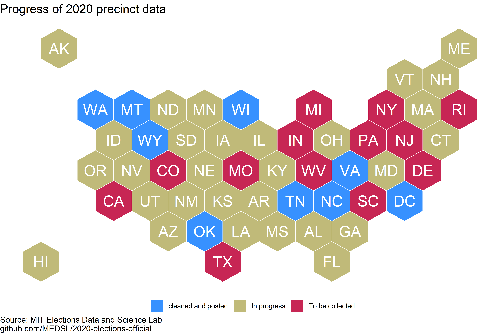

# 2020-elections-official

This is the MEDSL repository for official precinct returns for 2020 General Election.

 Users can download data by the level of office returns (president, US senate, US house, state, or local levels). For each state that is complete, users can also download all of the precinct-level returns separately in the folders above.
 

The returns are in progress, and will be updated periodically until completion. The following states and districts are included in the dataset:

## Arkansas

Added 02-16-2021. Local data not included at the moment.

## District of Columbia

Added 01-29-2021. For DC, the jurisdiction_name variable indicates ward number. Local data not included at the moment.

## Maryland

Added 02-09-2021. Local data not included at the moment.

## Montana

Added 02-02-2021.

## North Carolina

Added 01-27-2021.

## Oklahoma

Added 02-01-2021. Local data not included at the moment.

## Tennessee

Added 01-28-2021. Local data not included at the moment.

## Virginia

Added 01-27-2021.

Many of the write-in candidates in the Virginia elections show small discrepancies between the vote totals reported on the Virginia SOS website (here: https://results.elections.virginia.gov/vaelections/2020%20November%20General/Site/Presidential.html) and the votes in the raw data sheets. 

## Washington

Added 01-27-2021. Local data not included at the moment.

## Wisconsin

Added 01-29-2021.

## Wyoming

Added 02-03-2021.
