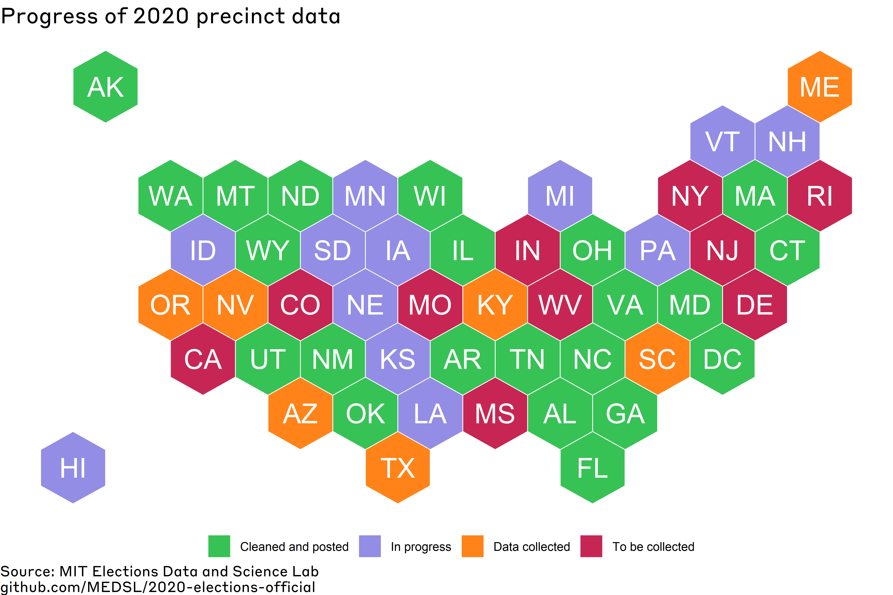

# 2020-elections-official

This is the MEDSL repository for official precinct returns for 2020 General Election.

 Users can download data by the level of office returns (president, US senate, US house, state, or local levels). For each state that is complete, users can also download all of the precinct-level returns separately in the folders above.
 

The returns are in progress, and will be updated periodically until completion. The following states and districts are included in the dataset:

## Alabama

Added 02-22-2021. Local data not included at the moment. Overvotes and Undervotes were not reported on offical canvas results so were not verified.

## Alaska

Added 02-23-2021. 

## Arkansas

Added 02-16-2021. Local data not included at the moment.

## Connecticut

Added 02-22-2021. Local data not included at the moment.

There were a small number of discrepancies between our cleaned precinct results and the results from the Secretary of State's website (https://ctemspublic.pcctg.net/#/selectTown). These seem to be from a couple of duplicate rows in the exported data, which we have removed in our cleaned data. This means that for a small number of offices, we will report a slightly lower number of total votes than the results posted online. 

Here are the discrepancies:

For office STATE SENATE district 024, SUSAN CHAPMAN has 823 in our data instead of 827 reported online

For office US HOUSE district 003, MARGARET STREICKER has 6026 in our data instead of 6030 reported online

For office US PRESIDENT, HAWKINS AND WALKER has 7529 in our data instead of 7538 reported online

For office US PRESIDENT, JORGENSEN AND COHEN has 20225 in our data instead of 20230 reported online

## District of Columbia

Added 01-29-2021. For DC, the jurisdiction_name variable indicates ward number. Local data not included at the moment.

## Florida

Added 03-08-2021. Local data not included at the moment. 

* Overvotes, Undervotes and some write-in candidate votes were not reported on offical canvas results so were not verified.

There are a number of very small discrepancies between our precinct data and  in the Florida data. Most of the discrepancies, when looking at aggregate vote totals, are less than 10 votes. The discrepancies come from Monroe County, Seminole County, and for some of the elections that had recounts. Here is a list of offices and districts with small discrepancies:

All statewide offices, including us president, supreme court, and all of the constitutional amendments

CIRCUIT JUDGE		15TH JUDICIAL CIRCUIT, GROUP 30

US HOUSE			District 007

US HOUSE			District 026

STATE SENATE		District 009

STATE SENATE		District 037

STATE SENATE		District 039

STATE HOUSE			District 028

STATE HOUSE			District 029

STATE HOUSE			District 030

STATE HOUSE			District 120

## Georgia

Added 03-18-2021. Local data not included at the moment.

## Hawaii

Added 04-02-2021. 

## Idaho

Added 04-05-2021. Local data not included at the moment.

* For Constitutional Amendment HJR 4, Power County reported 2,017 votes for YES (https://sos.idaho.gov/elections-division/2020-results-statewide/) while the raw data reported 1,967 votes. This accounts for the entirety of the vote difference when comparing the Secretary of State total (525,779) versus the raw data total (525,729).

## Illinois

Added 03-31-2021. Local data not included at the moment.

* Official IL results report only certain individual write-in candidates, while precinct data reports scatter wrtie-ins

* Judge McGlynn (District 020 Retention Race) is missing from official IL results. They were nominated and approved to serve in a federal district court in 2020.

## Maryland

Added 02-09-2021. Local data not included at the moment.

## Massachusetts

Added 02-19-2021. Local data not included at the moment. State legislative results added 03-23-2021.

## Montana

Added 02-02-2021.

## New Mexico

Added 03-28-2021. Local data not included at the moment.

* New Mexico "masks" vote totals in precinct results for candidates with small vote tallies, to protect the privacy of voters. These masked votes are denoted as "-1" in the votes column.

## North Carolina

Added 01-27-2021.

## North Dakota

Added 02-24-2021. Local data and state legislative election results not included at the moment.

## Ohio

Added 03-16-2021. Local data not included at the moment.

Ohio records its data with precincts on rows and candidates on columns. However, they record candidates that were not selectable in a particular precinct (because they did not run in a the associated district) as having received 0 votes, which is otherwise indistinguishable from candidates who ran in a precinct but received no votes. Keeping all these entries as is yields over 3 million records records and an extremely large file, so 0 vote records were manually dropped as follows:
  - Records for candidates running for US President were kept as is.
  - For all other records, entries with 0 votes were discarded.
This leads to the unfortunate situation where every other race (including US House, State Senate and State House elections, which are district based but do not list name of county) will have more records than needed removed (namely, records of candidates who ran in a precinct but got 0 votes there).

Ohio does not provide precinct-based vote totals for writein candidates, but they do provide a county-based vote total for each writein. The cleaned dataset aggregates all writeins per office on a county basis.

## Oklahoma

Added 02-01-2021. Local data not included at the moment.

## Tennessee

Added 01-28-2021. Local data not included at the moment.

## Utah

Added 03-16-2021. Local data not included at the moment.

*Duchesne county is short one vote compared to official sources (https://electionresults.utah.gov/elections/). As such, the county of Duchesne is flagged readme_check==True. 

## Virginia

Added 01-27-2021.

Many of the write-in candidates in the Virginia elections show small discrepancies between the vote totals reported on the Virginia SOS website (here: https://results.elections.virginia.gov/vaelections/2020%20November%20General/Site/Presidential.html) and the votes in the raw data sheets. 

## Washington

Added 01-27-2021. Local data not included at the moment.

## Wisconsin

Added 01-29-2021.

## Wyoming

Added 02-03-2021.
